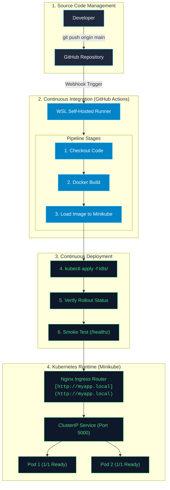

<div align="center">

# k8s-microservice-pipeline
### Production-Ready End-to-End Kubernetes Microservice CI/CD Deployment Pipeline

<p>
  
  
  
  
  
  
</p>

</div>

---

## 📌 Overview

This repository contains a cloud-native, automated end-to-end Kubernetes microservice pipeline. It demonstrates industry best practices for continuous integration, local container image delivery, declarative Kubernetes deployment, ingress traffic management, zero-downtime rolling updates, and health monitoring.

Whenever a commit is pushed to the `main` branch, an automated **GitHub Actions Self-Hosted Runner** triggers a full CI/CD workflow: building the Docker image, transferring it to Minikube, deploying Kubernetes manifests, and verifying health checks.

---

## 🏗️ End-to-End CI/CD Architecture

The architecture below illustrates the path from developer code commit to automated execution and live cluster routing:



---

## 📁 Repository Structure

```text
k8s-microservice-pipeline/
├── .github/
│   └── workflows/
│       └── ci-cd.yml    # GitHub Actions automated pipeline definition
├── app.py               # Python/Flask microservice with / & /healthz endpoints
├── requirements.txt     # Dependency definitions (Flask, gunicorn)
├── Dockerfile           # Optimized single-stage runtime image build
├── .dockerignore        # Excludes virtual environments, pycache, and git assets
└── k8s/
    ├── configMap.yml    # Application environment variables configuration
    ├── deployment.yml   # Workload definition (2 Replicas, Probes, Resource Limits)
    ├── service.yml      # Internal ClusterIP network exposure on Port 5000
    └── ingress.yml      # Path-based routing rules for host myapp.local
```

---

## 🚀 Getting Started Guide

### 1. Register GitHub Self-Hosted Runner (WSL)
```bash
# Register runner daemon under repo Settings -> Actions -> Runners
mkdir actions-runner && cd actions-runner
tar xzf ./actions-runner-linux-x64-*.tar.gz
./config.sh --url [https://github.com/](https://github.com/)<USER>/k8s-microservice-pipeline --token <TOKEN>

# Start background daemon service
sudo ./svc.sh install
sudo ./svc.sh start
```

### 2. Enable Local Networking & Ingress
```bash
# Enable Ingress controller
minikube addons enable ingress

# Start Minikube Tunnel (Keep open in a separate terminal tab)
minikube tunnel

# Map host entry in /etc/hosts or C:\Windows\System32\drivers\etc\hosts
127.0.0.1   myapp.local
```

### 3. Trigger Automated CI/CD
Simply commit and push any changes to trigger the full automated build and deployment:
```bash
git add .
git commit -m "feat: trigger automated pipeline build"
git push origin main
```

---

## 🛠️ Core Engineering Highlights

| Feature | Implementation Details |
| :--- | :--- |
| **Full Pipeline Automation** | End-to-end CI/CD powered by GitHub Actions targeting local Minikube via WSL self-hosted agent. |
| **Zero-Downtime Rolling Updates** | K8s rolling deployment strategy with readiness/liveness health checks ensures uninterrupted traffic. |
| **Resilient Traffic Management** | Nginx Ingress host routing (`myapp.local`) with ClusterIP service load balancing across multiple active pods. |
| **Automated Testing & Validation** | Post-deployment smoke testing (`/healthz` endpoint query) integrated directly into the CI pipeline. |

---

<div align="center">

<sub><b>k8s-microservice-pipeline</b> — Maintained by <b>Rini Sanyal</b> | Senior Embedded & Platform Engineer</sub>

</div>
# Pipeline Verified
